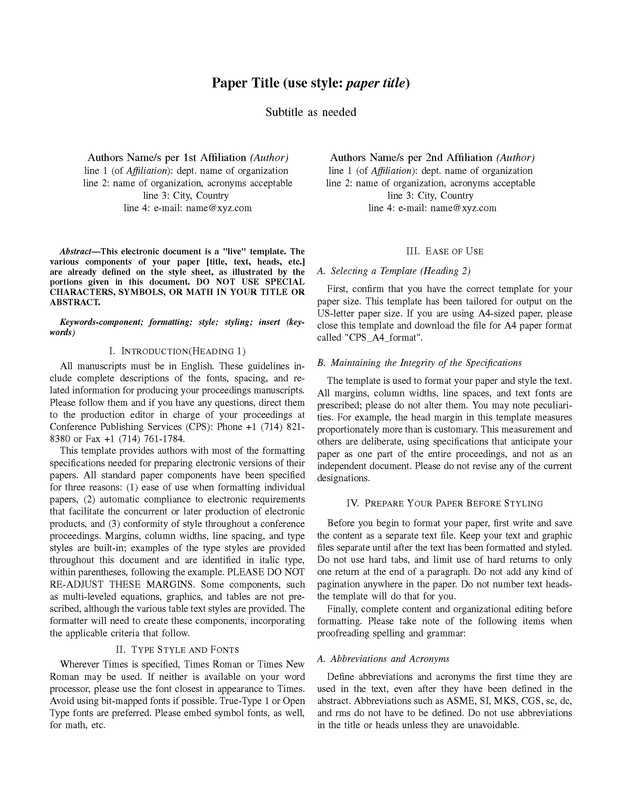
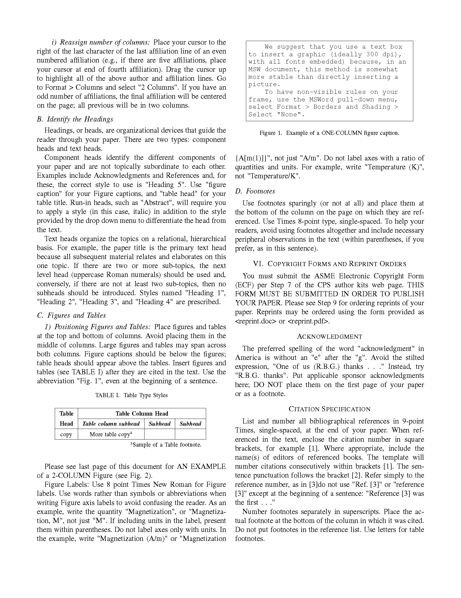

# A LaTex template for IEEE conferences 
[](https://github.com/WizenZhang/IEEE-Conferences-LaTex/releases)   

<span>
<!-- LaTeX Logo -->

<!-- IEEE Logo -->

</span>

**IEEEtran compliant LaTeX template. This document follows the official documentation provided at
the [IEEE](https://www.ieee.org/conferences/publishing/templates.html) and
the documentation developed by Michael Shell, the IEEEtran original author that provided a guide
``IEEEtran_HOWTO.pdf`` with all information needed to produce an IEEE compliant conference in LateX.**

The default configurations for this template are:

```latex
\documentclass[conference]{IEEEtran}
```


## Preview

**PDF preview:**[conference.pdf](https://raw.githubusercontent.com/WizenZhang/IEEE-Conferences-LaTex/master/conference.pdf)
 
  

## Download

+ [GitHub](https://github.com/WizenZhang/IEEE-Conferences-LaTex): [https://github.com/WizenZhang/IEEE-Conferences-LaTex/releases](https://github.com/WizenZhang/IEEE-Conferences-LaTex/releases)

## Usage

To use this template, you can simply fork or copy this repository and start working on it.

### Requirements

      

## Suggestion and  Feedback

+ E-mail: [wizen_zhang@163.com](wizen_zhang@163.com)
+ GitHub: [https://github.com/WizenZhang/IEEE-Conferences-LaTex/issues](https://github.com/WizenZhang/IEEE-Conferences-LaTex/issues)


***

By [Wizen Zhang](https://wizenzhang.github.io/), at NMU.